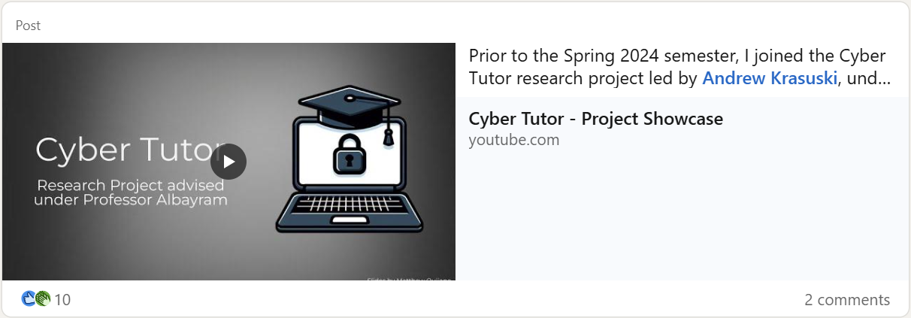
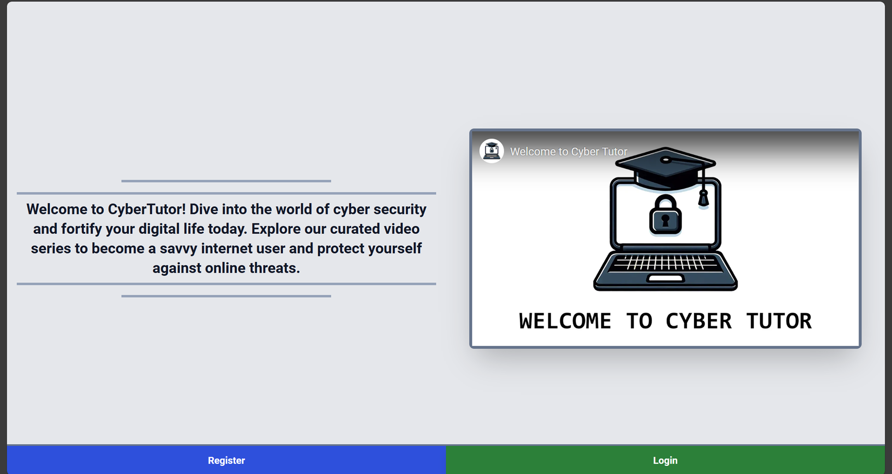
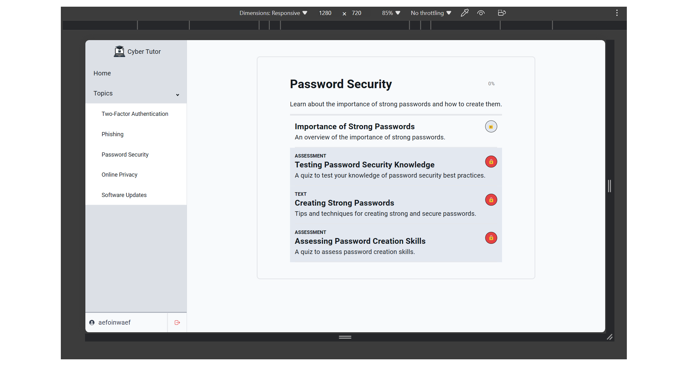
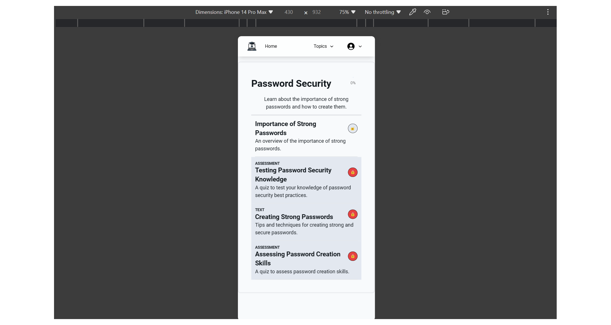

# Cyber Tutor Frontend

Contributors: Andrew Krasuski, Matthew Quijano, Sean Clifford, Roland Van Duine

Cyber Tutor is a proof-of-concept learning web-application with the goal of raising cybersecurity awareness among the general populous, leveraging artificial intelligence (Google Gemini) to provide a personalized learning experience.

[](https://www.linkedin.com/feed/update/urn:li:activity:7212262143935557632/)

## Main User Flow

1. A new user signs up and is assigned to either the `controlGroup` or `experimentalGroup`
   - For users in the `controlGroup`, they are treated with content from vetted, reputable sources
   - For users in the `experimentalGroup`, they are treated with content generated by artificial intelligence
   - Content includes `text`-based content (including image content generated by OpenAI's ChatGPT), and `video` content (generated by InVideo), according to user preference within their user settings
   - All data related to our application is stored within Firebase Firestore
2. The user is asked to take a proficiency survey
   - This proficiency exam covers the uesr's understanding of topics such as two-factor authentication, phishing, password security, online privacy, software updates, and more
3. Upon completion of the survey, their responses are then sent to Gemini, which returns an assignment of various levels of proficiency
   - The proficiency levels include `beginner`, `intermediate`, and `expert`
   - Depending on the proficiency level assigned to the user, they are able to skip past foundational content within the curated cirriculum
4. Based on the user's proficiency category, they are treated with content appropriate to that category.
5. After completing content (text-based or videos), the user is tested on their knowledge using a shared pool of questions standardized across both `controlGroup` and `experimentalGroup` users
6. If a user earns a passing score, they will unlock succeeding content, adding to their overall completion of our website's content. If a user fails, they will have the option to retake to earn a passing grade
7. Should the user complete 100% of all content of the website, they will be granted with a certificate demonstrating their hard work

## Screenshots





## Local Instance Instructions

1. Open Visual Studio Code, and open a new terminal
2. Clone the repository using the following command. After cloning, navigate to the root of the repository:

```bash
git clone https://github.com/Cyber-Tutor/Cyber-Tutor-Frontend.git
```

3. Within the root of the repository create an `.env.local` files ensuring all of the variables from `.env.template` are present
4. Install dependencies using the following command:

```bash
npm i
```

5. The repository should be ready for you to work with, and you can now boot up the development server using the following command:

```bash
npm run dev
```
